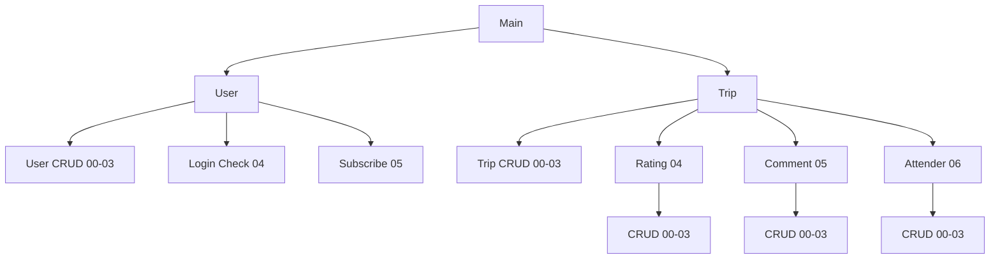

# API Reference v1.0
## Introduction
**API的位置** : /api/

** API Version** : v1.0

**HTTP Method** : POST

**Format of From Data**:

api = [request code]

data = [input data]
>送出後會拿到 RESPONSE 是由API的回應跟STATUS CODE 組成

## Status Code
**用途** : 讓前端了解API執行的狀態，並且進行處理

**格式** : 由三個0-9的數字組成，型態為字串(STRING) 
>EX:“ABC”

位置A : 成功(0) | 失敗(1)

位置B: 錯誤原因(如果有錯)

位置C:

| **A\B** | **0** | **不為0** |
|--|--|--|
|**1**|失敗的原因(CODE由各API定義)|B的補充說明|
|**0**|補充說明(CODE由各API定義)|--|

### 意義不因為呼叫的API不同而改變的STATUS CODE:
|**CODE**|**MEANING**|
|:--:|:--:|
|000|成功|
|110|使用者不存在|
|111|TOKEN過期 或是 不正確|
|112|拒絕存取(已成功登入，但權限不足)|
|120|呼叫不存在的API|
|130|資料庫連線失敗|
|131|操作資料庫時發生錯誤|
|140|不正確的 Input Data|
|150|發生未知的錯誤|

## Request Code
**用途** : 告訴後端要執行哪個API

**格式** : 型態為字串(STRING)，長度不一定


>示意圖 (整個系統為樹狀結構) 

**REQUEST CODE** : 從主系統 到 要執行的API 的路徑上所有的CODE 串接起來

## Input Data
**用途** : 執行API前端要給的資料

**格式**: application/json

>由各API定義

## API
### Abstract DataType

|**Type Name**|**Description**|
|--|--|
|i|integer|
|s|string|
|obj|object  ` {"key": value ,...}`|
|arr|array `[element1,element2,...]`|
|users|Specifying several users with an array.`[{"name":"name",...}, ...]`|
|field|Specifying tables’ field with an array`["user_id","name",...]`|
|scope|Specifying the range of data you want to get <br/> `[n,m]=> get n datas in m times. Ex:  [10,1] 1-10,  [10,2]11-20`|
|dataset|A key-value set of data ,and key is field on table.`{"name":"...","email":"...", ...} //user table`|

### Api Description
`* optional`

 **Main>user 01**
 
 **>create 00** 

|**Parameters**|**Description**|
|--|--|
|token : s|Use token to get the user data and create user with it.|

```
return : 
101 : User existing
```

 **>retrieve 01**

|**Parameters**|**Description**|
|--|--|
|token : s, `*field : field`|get user by token|
|user_ids : arr, token : s, `*field : field`|Get users by users' id|
|scope : scope, token : s, `*field : field`|Get users in range of scope|

`user_ids : Specifying several users' id with an array ["id1","id2",... ,"idn"]`
```
return:{"user":users}
001 : No data
```

**>update 02**

|**Parameters**|**Description**|
|--|--|
|dataset : obj, token : s|Update user data of token's owner with dataset|
|user_id : s, dataset : dataset|Update user data who's user_id equals user_id|

```
Rules:
1. No one can update user_id because that is a identity from facebook
2. No one can update own level
3. Only Administrator can update another user's level
4. Can't update other user's level,if the user's level above own
5. Can't update other user's level exceed own
```
```
return:
101 : Field not exists or DataType wrong
102 : Target User not exists
```

**>delete 03**

|**Parameters**|**Description**|
|--|--|
|user_id : s, token : s|Delete the user who's user_id equals the user_id|

`Administator only`
```
return:
101:Target user not exists
```

**>loginCheck 04**

|**Parameters**|**Description**|
|--|--|
|token : s|return success(000) if user exists|

## User Levels

|**Level**|**Desciption**|
|--|--|
|0|blocked|
|1|general|
|2|administator|
|3|developer|

## DATETIME

### 時間日期表示方式
```
Y = 年 0000-9999
m = 月 01-12
d = 日 01-31
H = 時 00-23
I = 分 00-59
S = 秒 00-59
```

**1 .	指定日期**: YmdHis => 直接串接 像2018/02/02 T19:59:00 可以表示成 20180202195900

**2 .	日期計算(scope限定)** :
-1year 1年前, +1year 1年後 同用法 month day hour minute second week
 
now => 現在時間

星期指定 monday (這禮拜星期一) next Monday (下禮拜星期一) last Monday(上禮拜星期一)

例子:
	-5week : 5周前
	
20170501000000 +3month :2017/05/01 T00:00:00 的3個月後
(關於計算的可行性 可在[http://strtotime.co.uk](http://strtotime.co.uk) 上試試)
